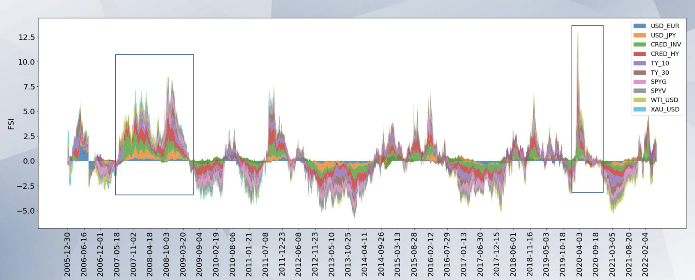

## FSI (Financial Stress Indicator) during the COVID-19 pandemic
  

### Overview

This project evaluates whether the COVID-19 pandemic constituted a period of elevated financial stress in U.S. markets. The analysis leverages both the official OFR Financial Stress Index (FSI) and a custom FSI constructed from key market indicators, and it compares market dynamics with the 2008–2009 financial crisis. In proncipal the methodology relies on Principal Component Analysis with a couple of workarounds (flipping signs, rolling windows, etc.) - methodology details are provided in the presentation “Financial Stress in Covid.pdf.”

### Data

Datasets used in this project are contained in:

- FSI_Indicators_Data.zip — Asset-class level data (split by Credit, Equity, IR, FX, Volatility)

- FSI_S_P_500_Segments_Data.zip — Sector level data (split by 11 Sectors of the US economy, e.g. Financials, Energy, etc.)

- Date range: 2005-01-01 → 2022-05-28

### Notebooks

- OFR_FSI.ipynb  
  Performs the FSI analysis for the overall U.S. financial market against individual asset clases

- OFR_FSI_S_P_500_Segments.ipynb  
  Breaks the analysis out by S&P 500 sectors to measure stress contributions of specific sectors.

### Key Findings (Summary)

- COVID-19 triggered a sharp but short-lived surge in financial stress.

- Credit spreads widened more than equity markets fell.

- Growth stocks outperformed value stocks.

- Treasury yields plunged amid a flight to safety.

- Oil was extremely volatile; gold remained largely uncorrelated.

- High-stress sectors included Energy, Financials, Industrials, and Consumer Discretionary.

- Technology and Healthcare were among the lower-stress sectors.